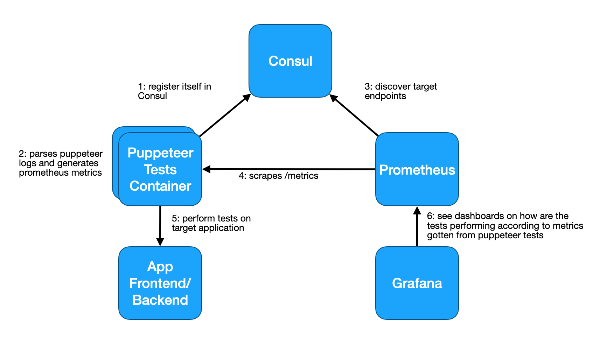
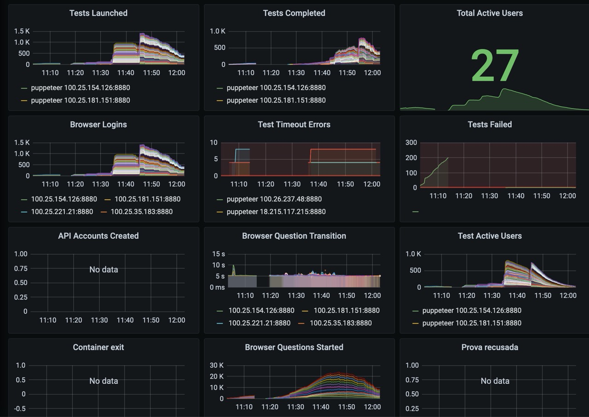

# distributed-puppeteer-example

Puppeteer example with distributed tests that may be scaled with container instances and monitoring through Prometheus.



* You have to change the test and some code with your own website in order for this to work.


* During test execution you will see in Grafana something like



Build the optimal metrics using promgrep (see start_monitored_resolve_restudantes.sh) for your case and create your own Grafana dashboards.

The ideal is you to place other monitoring resources on the same dashboard to verify the test performance along with CPU, memory, network and other types of indicators that everything is right, or, if not everything is all right, what maybe the root cause.

By experience, building and running load tests is more about development than simply "testing". You will get lots of bugs on edge cases and will have to make optimizations as you perform the load tests with more and more users among the various components of your solution. Be open and always verify if things are matching. Never be too optimistic so you may leave importants things behind.

## Usage

```sh
docker-compose up -d
docker-compose scale tests=10
```

