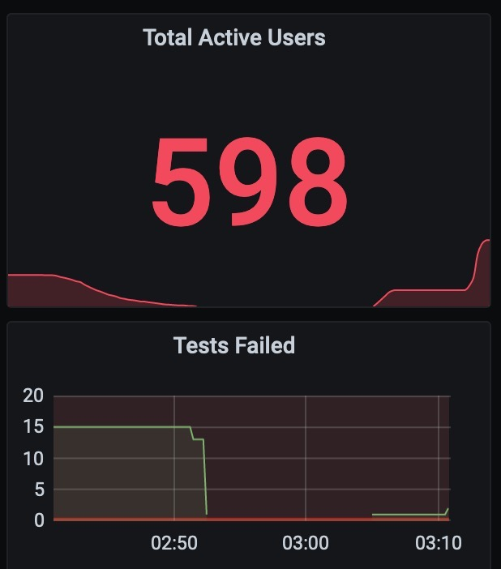

# distributed-puppeteer-example

Puppeteer example with distributed tests that may be scaled with container instances and monitoring through Prometheus.


* You have to change the test and some code with your own website in order for this to work.


* During test execution you will see in Grafana something like




## Usage

```sh
docker-compose up -d
docker-compose scale tests=10
```

